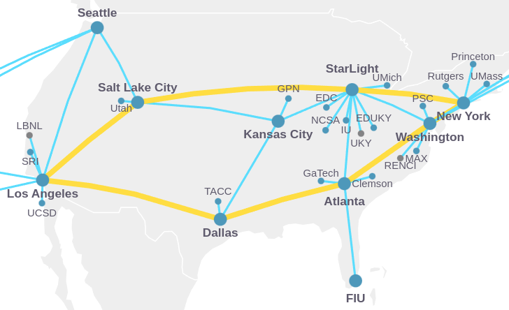

# SBRC 2024

Official repository for the paper "[TITLE]" to the [SBRC 2024](https://sbrc.sbc.org.br/2024/).

## Overview

This repository serves as a comprehensive archive of the data and associated command scripts presented in the article "[TITLE]," originally submitted to the SBRC 2024.

## Slice Deployment and Experimentation with the FABRIC Testbed

    

    <em>Figure 1. FABRIC nationwide network topology</em>

